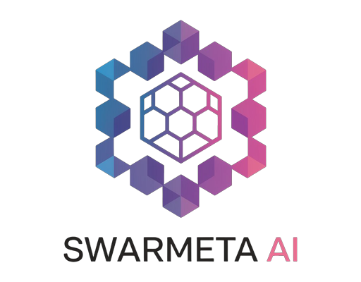

  

<h1 align="center">Swarmeta API 介绍</h1>

<h2 id="intro">介绍</h2>

Swarmeta API是一个低价API中转服务平台，提供多种AI模型服务。
我们以优惠的价格为用户提供各种大语言模型的使用。

- **官网**：[Swarmeta-ai.me](https://swarmeta-ai.me)
- **基础计费单位**：点数(Hexa)
- **基础兑换比例**：1 CNY = 10 Hexa

<h2 id="how-to-use">如何使用</h2>

Swarmeta API提供标准OpenAI格式的API调用。

**基础API URL**: https://swarmeta-ai.me/api/v1

您也可以直接在我们的网站[Swarmeta-ai.me](https://swarmeta-ai.me)与模型对话。

<h2 id="pricing">价格表</h2>

以下是目前Swarmeta API提供的各种模型及其价格（单位：点数/1000 Token）：

| 模型名称 | 输入价格 | 输出价格 |
|---------|:-------:|:-------:|
| gpt-4o-mini | 0.002	| 0.008 |
| gpt-4o | 0.030	| 0.120 |
| gpt-4 | 0.300	| 0.600 |
| gpt-o1-mini | 0.035 | 0.140 |
| gpt-o1-preview | 0.180 | 0.600 |
| gemma2-9b-it | 0.005 | 0.005 |
| Internlm2.5-20B-Chat | 0.014 | 0.014 |
| Qwen2.5-7B-Instruct | 0.005 | 0.005 |
| Qwen2.5-14B-Instruct | 0.010 | 0.010 |
| Qwen2.5-32B-Instruct | 0.020 | 0.020 |
| Qwen2.5-72B-Instruct | 0.055 | 0.055 |
| Baichaun3-Turbo | 0.025 | 0.025 |
| Baichuan4 | 0.160 | 0.160 |
| yi-lightning | 0.01 | 0.01 |
| yi-medium | 0.015 | 0.015 |
| yi-large | 0.088 | 0.088 |
| gemini-1.5-flash-002 | 0.013 | 0.013 |
| gemini-1.5-flash | 0.010 | 0.010 |
| gemini-1.0-pro | 0.020 | 0.020 |
| gemini-1.5-pro | 0.066 | 0.066 |
| gemini-1.5-pro-002 | 0.080 | 0.080 |
| gemini-1.5-flash-exp | 0.012 | 0.012 |
| gemini-1.5-flash-8b-exp | 0.008 | 0.008 |
| gemini-1.5-pro-exp | 0.060 | 0.060 |
| llama3.1-8b | 0.005 | 0.005 |
| llama3.1-70b | 0.040 | 0.040 |
| llama-3.1-8b-instruct | 0.005 | 0.005 |
| llama-3.1-70b-instruct | 0.040 | 0.040 |
| llama-3.1-405b-instruct | 0.160 | 0.160 |
| llama-3.2-1b-instruct | 0.002 | 0.002 |
| llama-3.2-3b-instruct | 0.003 | 0.003 |
| llama-3.1-70b-fp8 | 0.035	| 0.035 |
| llama-3.1-405b-fp8 | 0.150 | 0.150 |
| llama-3.2-11b-vision-fp8 | 0.008 | 0.008 |
| llama-3.2.90b-vision-fp8 | 0.060 | 0.060 |

> ⚠️ **注意**：
> - 所有模型均按Token计费，价格单位为点数/1000 Token。
> - 网站的各模型均处于试运行阶段，有不稳定的可能性，并且价格有可能会上下浮动。

<h2 id="recharge">充值方案</h2>

**基础充值比例**：1 CNY = 10 Hexa

充值活动：

| 充值金额 (CNY) | 获得点数 | 赠送比例 |
|---------------|---------|---------|
| 6 | 64.8 | 8% |
| 18 | 198 | 10% |
| 38 | 428 | 12.6% |
| 68 | 788 | 15.8% |

**充值请联系客服**：
- QQ🐧 1744530591
- QQ🐧 2498068750

**技术问题请联系**：
- QQ🐧 3450354617
